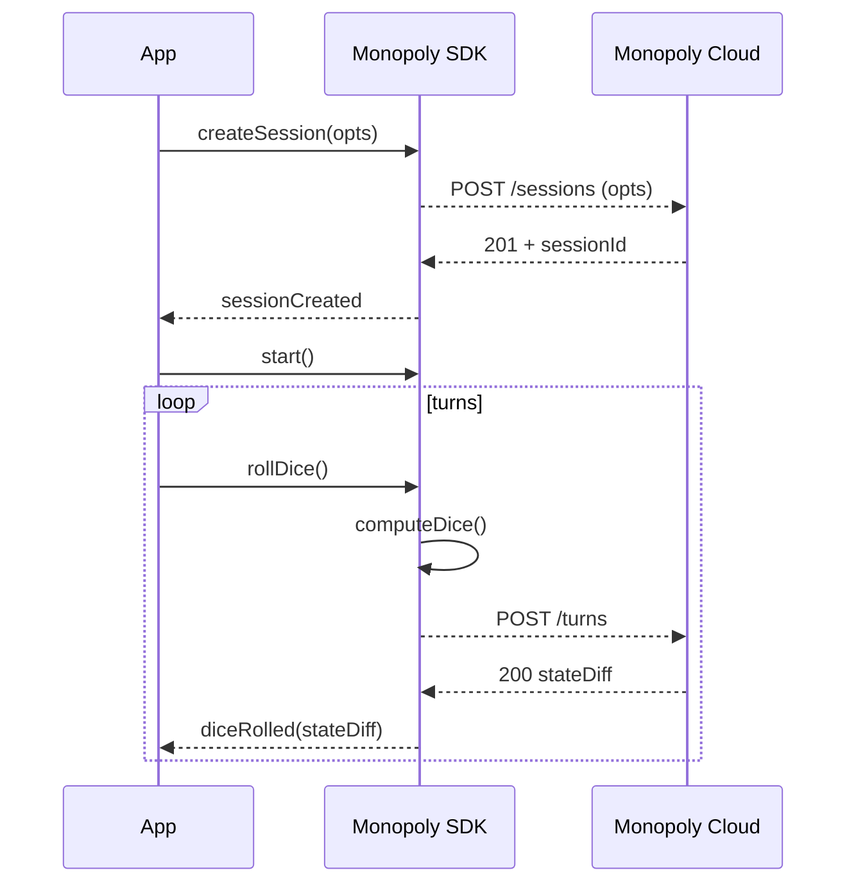

# Monopoly SDK Architecture Overview

> **Version**: 1.0.0\
> **Last updated**: 24 June 2025

The Monopoly SDK is designed as a **thin, deterministic client‑side engine** that communicates with Monopoly Cloud for authoritative state and persistence. It is written in TypeScript, distributed as ESM/CJS bundles, and organised as a **monorepo** of composable packages.

This document provides a high‑level architectural overview for contributors, integrators, and auditors.

---

## Table of Contents

- [Monopoly SDK Architecture Overview](#monopoly-sdk-architecture-overview)
  - [Table of Contents](#table-of-contents)
  - [1. Architectural Goals](#1-architectural-goals)
  - [2. High‑Level Component Map](#2-highlevel-component-map)
  - [3. Package Breakdown](#3-package-breakdown)
  - [4. Runtime Flow](#4-runtimeflow)
  - [5. Data Model \& State Store](#5-datamodelstatestore)
  - [6. Event Bus](#6-eventbus)
  - [7. Networking Layer](#7-networkinglayer)
  - [8. Persistence \& Recovery](#8-persistencerecovery)
  - [9. Extensibility Points](#9-extensibilitypoints)
  - [10. Build \& Tooling Pipeline](#10-buildtoolingpipeline)
  - [11. Future Directions](#11-futuredirections)
    - [Questions?](#questions)

---

## 1. Architectural Goals

| Goal                         | Rationale                                                  |
| ---------------------------- | ---------------------------------------------------------- |
| **Deterministic game logic** | Enables client validation & replay.                        |
| **Network‑agnostic**         | Works in browsers, React Native, Node.js, service workers. |
| **Tree‑shakable**            | Consumers only pay for features they import.               |
| **Side‑effect free modules** | Facilitates static analysis and bundler optimisation.      |
| **Extensible via plugins**   | Allows AI opponents, custom dice, analytics hooks, etc.    |
| **Minimal runtime deps**     | Keeps bundle size < 45 KB min+gzip.                        |

---

## 2. High‑Level Component Map

```txt
┌───────────────────────────────────┐
│            Host App              │
└───────────────────────────────────┘
          ▲               ▲
          │               │ UI bindings (optional)
          │               │
          │        ┌───────────────┐
Core API   │        │   @monopoly/ui│
calls      │        └───────────────┘
          │               ▲
          │               │ consumes SDK events
          │               │
┌───────────────────────────────────┐
│         @monopoly/sdk (core)     │
├───────────────┬──────────────────┤
│ Game Engine   │ Event Bus        │
│ (rules)       │                  │
├───────────────┴──────────────────┤
│   State Store  │  Persistence    │
└────────────────┴─────────────────┘
          ▲               ▲
          │               │ JSON‑RPC over HTTPS / WebSocket
          │               │
┌───────────────────────────────────┐
│        Monopoly Cloud API         │
└───────────────────────────────────┘
```

---

## 3. Package Breakdown

| Package | Description                                     | Entry points              |
| ------- | ----------------------------------------------- | ------------------------- |
| ``      | Core engine, event bus, session orchestration   | `./index.ts` (ESM/CJS)    |
| ``      | Headless React/Vue/Svelte components (optional) | `./react.tsx`, `./vue.ts` |
| ``      | AI opponents trained on Monte‑Carlo simulations | `./bot.ts`                |
| ``      | Shared Zod schemas & TS types                   | `./index.ts`              |
| ``      | Dev utilities, local mock server                | `bin/monopoly`            |

All packages live under `packages/` and share build tooling (ESBuild + Changesets).

---

## 4. Runtime Flow



> **Determinism**: The SDK simulates dice locally using a pre‑shared RNG seed but treats Monopoly Cloud as the source of truth.

---

## 5. Data Model & State Store

State is kept in an **immutable Event Sourced store**. Each move produces a `Command` → `Event` → `Reducer` producing a new read‑only snapshot.

```
interface Command { type: "ROLL_DICE" | "BUY_PROPERTY" | …; payload?: any }
interface Event   { type: "DICE_ROLLED" | "PROPERTY_BOUGHT" | …; revision: number }
interface State   { players: Player[]; board: Tile[]; bank: Bank; … }
```

Snapshots are serialised to JSON (\~4–5 KB) for persistence and debugging.

---

## 6. Event Bus

- Uses a **typed pub‑sub** system (`on<T>(event, handler)`)
- Handlers execute in **topological order** (parents before children)
- Supports **once**, **off**, and wildcard `*` listeners
- Internally built on a [`Map<string, Set<Fn>>`] with micro‑task batching to avoid re‑entrancy issues.

---

## 7. Networking Layer

| Protocol           | Purpose                         | Notes                               |
| ------------------ | ------------------------------- | ----------------------------------- |
| **HTTPS JSON‑RPC** | CRUD on sessions, turns, assets | Retriable with exponential back‑off |
| **WebSocket**      | Real‑time push (spectator mode) | Optional; falls back to polling     |
| **Web Transport**  | Offline P2P sync (experimental) | Behind feature flag                 |

The layer is abstracted behind `HttpTransport` & `SocketTransport` interfaces, enabling mocking in tests and self‑hosting.

---

## 8. Persistence & Recovery

1. **In‑memory** (default) – fastest for short games.
2. **IndexedDB** – automatic when available; quotas checked.
3. **Custom adapter** – supply `Monopoly.defaults.store = myStore` implementing `getSnapshot()` / `setSnapshot()`.

On `session.saveState()` the current snapshot + RNG seed + revision are stored; `Monopoly.resumeSession()` hydrates from that data.

---

## 9. Extensibility Points

| Hook                      | Use case                                       |
| ------------------------- | ---------------------------------------------- |
| `Monopoly.defaults.fetch` | Bring‑your‑own polyfill or SSR edge fetch      |
| `session.middleware`      | Intercept/augment commands (analytics, cheats) |
| `plugin.register()`       | Inject new events, tiles, or rules             |
| `theme.register()`        | Add custom board skins & tokens                |

Plugins are ES modules exporting a `MonopolyPlugin` object.

```typescript
export const glamTheme: MonopolyPlugin = {
  id: "theme-glam",
  install(engine) {
    engine.addBoardSkin("glam", { … });
  }
};
```

---

## 10. Build & Tooling Pipeline

| Tool               | Purpose                                  |
| ------------------ | ---------------------------------------- |
| **ESBuild**        | Transpile TS → ES2020, minify, emit d.ts |
| **Tsup**           | Wraps ESBuild for dual ESM+CJS bundles   |
| **Vitest**         | Unit/integration tests with JSDOM        |
| **Changesets**     | Automated semver & CHANGELOG generation  |
| **Release Please** | GitHub Action to publish to npm on tags  |

Bundles ship with **source maps** and enforced export map (`package.json#exports`).

---

## 11. Future Directions

- **WebAssembly core** for improved RNG & performance
- **CRDT‑based offline mode** for fully peer‑to‑peer games
- **Rust port** targeting WASI & native desktop
- **GraphQL transport** to replace JSON‑RPC

---

### Questions?

Open a discussion on GitHub or ping `@maintainers` on Discord.
